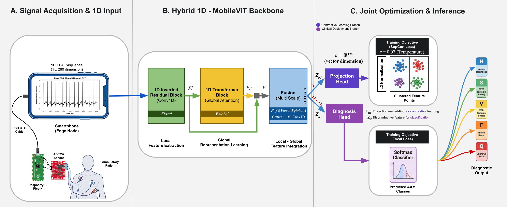

# A Hardware-Aware 1D-MobileViT Framework for Efficient Edge-Based ECG Arrhythmia Detection

[](https://colab.research.google.com/drive/1hOVnU72gPdJAdD8ccw0TriAKUNc7EKwv) 
[]()
[]()

This repository contains the official PyTorch implementation and hardware profiling code for the manuscript **"A Hardware-Aware 1D-MobileViT Framework for Efficient Edge-Based ECG Arrhythmia Detection"**, submitted to *Computer_Methods_and_Programs_in_Biomedicine_(CMPB)*.

## 📌 Overview
Continuous ECG monitoring in ambulatory settings requires models that achieve high diagnostic performance while remaining computationally frugal. We propose a **1D-MobileViT** architecture that bypasses computationally expensive 2D time-frequency transformations (e.g., CWT), processing raw 1D ECG signals natively. 

Coupled with a **Supervised Contrastive Learning (SupCon)** objective to handle clinical class imbalance, the framework is validated through an edge-simulation profiling approach mimicking a low-latency, offline wearable node architecture via USB OTG.

### ✨ Key Features
- **Ultra-Lightweight:** Only **0.34M parameters** and **~4.9M MACs**.
- **Real-Time Edge Inference:** Evaluated via ONNX Runtime (Opset 18, Single-Threaded CPU) with a simulated latency of **~3.0 ms** per heartbeat, reflecting constrained mobile ARM environments.
- **Robust Generalization:** Achieves a strong **Weighted F1-score of 86.00%** under strict unseen patient-specific (DS1/DS2) protocols on MIT-BIH, and maintains robust cross-dataset performance on INCART.
- **Reproducible Software Pipeline:** The repository provides a fully automated, end-to-end Python methodology—from cloud-based dataset extraction to ONNX-based mobile hardware simulation—designed for immediate clinical research integration.

## 🏗️ Architecture

The proposed architecture integrates local feature extraction via efficient 1D convolutions with global dependency modeling using lightweight attention mechanisms. 

<p align="center">
  
  <br><em>Fig 1: Schematic overview of the proposed 1D-MobileViT-based framework, including signal acquisition concept and joint optimization via SupCon.</em>
</p>

## 🛠️ Project Structure & Data
To ensure a seamless reviewer experience and immediate reproducibility, both benchmark datasets (MIT-BIH & INCART) have been pre-processed according to the AAMI EC57 standard and securely cached. 

The provided "Google Colab Notebook" contains an automated smart data pipeline that downloads these arrays directly, avoiding the extensive processing time associated with raw PhysioNet extraction.

## 🚀 How to Run (1-Click Execution)

The entire experimental pipeline—from data loading to training, external validation, and hardware profiling—is encapsulated in a single, well-documented Jupyter Notebook.

1. Click the **"Open In Colab"** badge at the top of this repository.
> **⚠️ Note for Reviewers:** 
> When executing the first cell (Module 1: Setup), Google Colab may display transient warnings or version conflict messages related to its pre-installed backend packages. Please **ignore these warnings**. They do not affect the execution of our 1D-MobileViT architecture. The code is designed to run end-to-end flawlessly.
3. Run the cells sequentially.
4. The notebook will automatically:
   - Download the pre-processed ECG datasets.
   - Initialize the compact 1D-MobileViT backbone.
   - Train using the dual-loss (Focal + SupCon) strategy.
   - Generate publication-ready visualizations (Learning Curves, Confusion Matrix, t-SNE).
   - Perform strict cross-dataset evaluation on INCART.
   - Simulate Edge Hardware Latency using ONNX Runtime.

## 🖥️ Conceptual Hardware & Profiling
The clinical acquisition pipeline is conceptually designed around a continuous **Raspberry Pi Pico H** microcontroller interfaced with an **AD8232** sensor. 

To validate the inference feasibility of this setup prior to full-scale clinical hardware deployment, the codebase includes a rigorous hardware profiling module. The trained model is exported to **ONNX format (Opset 18)** and executed using strict single-threaded CPU execution to realistically emulate a modern smartphone edge node connected via USB OTG.

## 📝 Citation
If you find this code or methodology useful for your research, please cite our paper:
```bibtex
@article{1DMobileViT_CBM,
  title={A Hardware-Aware 1D-MobileViT Framework for Efficient Edge-Based ECG Arrhythmia Detection},
  author={Anonymous for Review},
  journal={Computer Methods and Programs in Biomedicine},
  year={2026}
}
